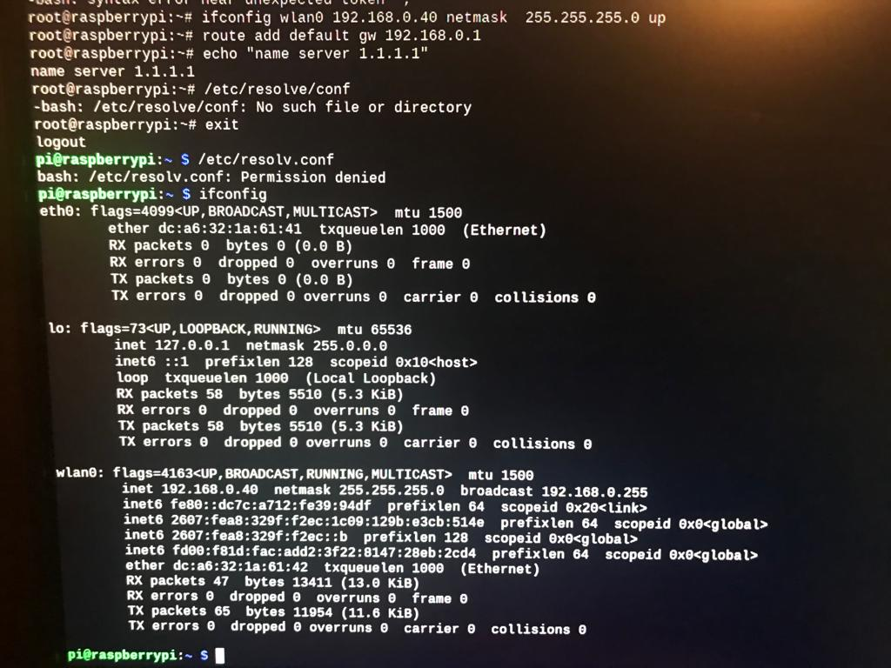

## Comment configurer son addresse ip statique sur Rasbian

:one: Ouvrir le terminal et se connecter en tant que Super Utilisateur.

```
pi@rasberrypi:~ $ sudo -i
```

:two: Entrer sur l'interface en question et mettre l'addresse ip statique, le netmask, ainsi que le gateway. 

```
root@rasberrypi:~# ifconfig wlan0 192.168.0.40 netmask 255.255.255.0 up
root@rasberrypi:~# route add default gw 192.168.0.1
root@rasberrypi:~# echo "name server 1.1.1.1"
root@rasberrypi:~# exit
```

:three: Verifier votre configuration

```
pi@rasberrypi:~ $ ifconfig wlan0
```

# Visuel


# Author: Toch Etienne <etiennetochgaly@gmail.com>
